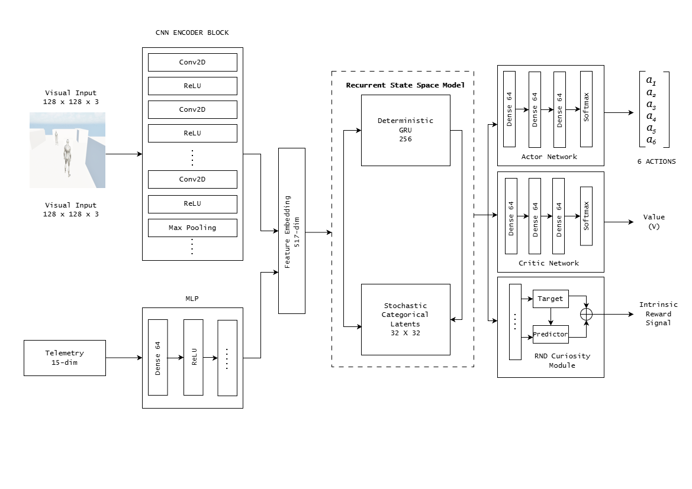

# Multimodal World Models for Autonomous Game Agents: Emergent Tactical Planning via Latent Imagination

An end-to-end Model-Based Reinforcement Learning (MBRL) framework interfacing **DreamerV3** with **Unreal Engine 5 (UE5)**. The autonomous agent learns latent environmental dynamics across vision and spatial telemetry, imagining future outcomes purely in latent space to make emergent, real-time tactical decisions without pre-baked waypoints or rigid behavior trees.


---


## Architecture


<p align="center">
  
</p>


---


## Demo


<p align="center">
  【!Multimodal World Models for Autonomous Game Agents: Emergent Tactical Planning 】(thumbnail.png) (https://www.bilibili.com/video/BV1p8YC67ERg/?share_source=copy_web&vd_source=dd00f33f42630dc8f07207b666bfbd3f)
</p>


---


## Key Highlights

- **Pure Model-Based RL (DreamerV3)**: Powered by a Recurrent State-Space Model featuring discrete categorical latents ($32 \times 32$) and GRU deterministic transitions.
- **Multimodal Perception**: Fuses 128×128 first-person RGB camera feeds (via ConvEncoder) with a 15-dimensional spatial telemetry vector (coordinates, threat assessment, AI perception, and opponent history).
- **Emergent Tactical Planning**: Discovers dynamic cover usage, line-of-sight breaking, and evasion through latent imagination rollouts.
- **Low Latency Damage Interrupt**: Micro-interval damage polling detects bullet impacts in real time, waking the agent instantly for immediate evasive reactions.
- **Exploration & Curriculum**: Incorporates Random Network Distillation (RND) intrinsic curiosity with an automated win-rate-driven step delay curriculum.
- **Sub-20ms Inference**: PyTorch AMP GPU inference communicating asynchronously with UE5 over UnrealCV TCP sockets.

---

## Project Structure

```
NPC_Brain/
├── dreamerv3/             # Core World Model Architecture
│   ├── config.py          # Network & training hyperparameters
│   ├── model.py           # ConvEncoder, RSSM, Actor, Critic, RewardDecoder
│   └── trainer.py         # World model ELBO & imagination actor-critic training
├── environment/           # Unreal Engine 5 Bridge
│   ├── ue5_env.py         # UnrealCV interface, socket polling, damage interrupts
│   ├── action_controller.py
│   └── action_validator.py
├── perception/            # Threat detection & visual feature heads
│   ├── threat_detector.py
│   └── lightweight_threat_head.py
├── utils/                 # Training Support & Telemetry
│   ├── rewards.py         # Tactical reward function (cover, distance, anti-camp)
│   ├── curriculum.py      # Win-rate based step-delay progression
│   ├── rnd.py             # Random Network Distillation exploration bonus
│   ├── opponent_model.py  # Opponent movement and engagement tracking
│   ├── replay_buffer.py   # Multi-step sequence replay buffer
│   └── logger.py          # Weights & Biases (WandB) metrics tracker
├── train.py               # Main training pipeline loop
└── .gitignore
```

---

## Getting Started

### Prerequisites

- Python 3.10+
- Unreal Engine 5.6 or above with [UnrealCV](https://unrealcv.org/) plugin enabled
- NVIDIA GPU RTX 3060 or above with CUDA 11.8 & PyTorch

### Setup

```bash
# Clone the repository
git clone https://github.com/Abhigyan9831/Multimodal-World-Models-for-Autonomous-Game-Agents-Emergent-Tactical-Planning-via-Latent-Imagination.git
cd Multimodal-World-Models-for-Autonomous-Game-Agents-Emergent-Tactical-Planning-via-Latent-Imagination

# Install dependencies
pip install torch torchvision numpy unrealcv wandb psutil Pillow
```

### Running the Training Loop

1. Launch your Unreal Engine 5 scene and click **Play**.
2. Start the training script:
```bash
python train.py
```

---

## Telemetry & Logging

Live training metrics, loss breakdowns, and step-level system latencies stream directly to **Weights & Biases (WandB)**:
- `Losses/*`: World model ELBO, KL divergence, Actor loss, Critic loss
- `Latency/*`: Perception capture, neural inference, and UE5 step latency
- `Game/*`: In-cover percentage, survival duration, and tactical win rates

---

## License

MIT License. Designed for academic and research explorations in modern Game AI and Model-Based Reinforcement Learning.
